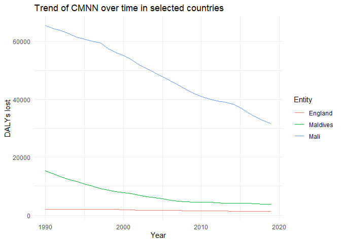
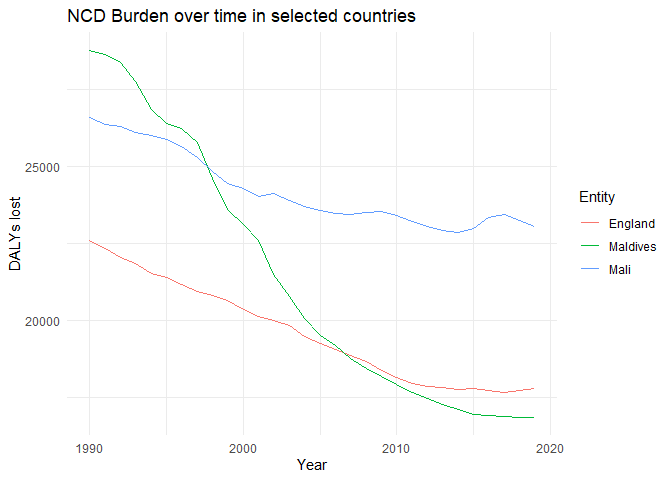

Global Disease Burden Analysis
================
Alice Osmaston

# Introduction

This document compares the Disability-Adjusted Life Year (DALY) diseases
burden for three countries: England, Mali, and The Maldives. We compare
the burden due to communicable, maternal, neonatal, and nutritional
diseases (CMNN), non-communicable diseases (NCDs), and overall disease
burden for these countries.

The source data is from the Institute for Health Metrics and Evaluation
(IHME) Global Burden of Disease (GBD) study.

# Communicable, Maternal, Neonatal, and Nutritional Disease Burden (CMNN)

## Table of Estimates for CMNN Burden Over Time

| Year |  England |  Maldives |     Mali |
|-----:|---------:|----------:|---------:|
| 1990 | 2052.656 | 15258.872 | 65416.57 |
| 1991 | 2021.267 | 14248.135 | 64433.33 |
| 1992 | 1970.460 | 13240.417 | 63690.15 |
| 1993 | 2015.722 | 12379.402 | 62661.49 |
| 1994 | 2026.017 | 11589.529 | 61475.68 |
| 1995 | 2041.288 | 10820.572 | 60708.48 |
| 1996 | 2039.603 |  9999.319 | 59990.45 |
| 1997 | 2010.301 |  9180.319 | 59604.32 |
| 1998 | 1980.036 |  8657.953 | 57608.13 |
| 1999 | 1974.135 |  8227.261 | 56311.59 |
| 2000 | 1902.330 |  7799.606 | 55260.98 |
| 2001 | 1808.138 |  7370.746 | 53811.09 |
| 2002 | 1750.155 |  6941.463 | 52022.02 |
| 2003 | 1743.163 |  6457.413 | 50549.41 |
| 2004 | 1681.955 |  5962.674 | 49210.09 |
| 2005 | 1654.986 |  5645.149 | 47854.99 |
| 2006 | 1631.494 |  5151.649 | 46490.23 |
| 2007 | 1603.421 |  4868.693 | 45017.50 |
| 2008 | 1579.034 |  4676.560 | 43445.70 |
| 2009 | 1540.387 |  4535.682 | 42041.20 |
| 2010 | 1500.426 |  4425.197 | 41018.91 |
| 2011 | 1474.033 |  4395.966 | 40121.15 |
| 2012 | 1443.636 |  4268.931 | 39404.61 |
| 2013 | 1419.420 |  4199.197 | 39155.16 |
| 2014 | 1401.538 |  4146.832 | 38407.16 |
| 2015 | 1410.057 |  4115.125 | 37223.42 |
| 2016 | 1402.872 |  4104.555 | 35366.95 |
| 2017 | 1389.445 |  4015.625 | 33877.42 |
| 2018 | 1387.733 |  3835.049 | 32695.68 |
| 2019 | 1390.384 |  3726.542 | 31637.11 |

## Plot Showing Trends in CMNN Burden Over Time

<!-- -->

## Summary of CMNN Burden Findings

Over the 30-year period shown above, the number of DALYs lost decreased
in all countries with Mali showing the biggest change however it still
has the higest number of DALYs lost. In England there has been a minor
decrease. In the Maldives the number of DALYs lost fell fastest between
1990-2005 and has remained fairly stable since then.

# Non-Communicable Disease Burden (NCD)

## Table of Estimates for NCD Burden Over Time

| Year |  England | Maldives |     Mali |
|-----:|---------:|---------:|---------:|
| 1990 | 22599.27 | 28759.60 | 26604.22 |
| 1991 | 22330.32 | 28633.49 | 26377.96 |
| 1992 | 22034.77 | 28384.07 | 26304.73 |
| 1993 | 21864.52 | 27758.93 | 26121.20 |
| 1994 | 21515.72 | 26844.81 | 26003.56 |
| 1995 | 21389.06 | 26407.58 | 25883.18 |
| 1996 | 21172.35 | 26249.25 | 25655.25 |
| 1997 | 20941.61 | 25773.94 | 25292.47 |
| 1998 | 20810.01 | 24611.73 | 24835.19 |
| 1999 | 20667.85 | 23600.97 | 24455.91 |
| 2000 | 20365.73 | 23110.79 | 24303.60 |
| 2001 | 20136.31 | 22586.61 | 24035.24 |
| 2002 | 20006.65 | 21487.93 | 24123.11 |
| 2003 | 19839.74 | 20768.76 | 23903.34 |
| 2004 | 19488.02 | 20072.84 | 23719.50 |
| 2005 | 19247.03 | 19518.84 | 23563.05 |
| 2006 | 19066.40 | 19181.78 | 23468.72 |
| 2007 | 18851.85 | 18766.80 | 23452.33 |
| 2008 | 18666.04 | 18427.85 | 23513.17 |
| 2009 | 18368.76 | 18172.54 | 23534.77 |
| 2010 | 18148.14 | 17933.30 | 23416.57 |
| 2011 | 17950.34 | 17667.15 | 23215.14 |
| 2012 | 17847.50 | 17453.74 | 23056.79 |
| 2013 | 17826.77 | 17273.67 | 22929.54 |
| 2014 | 17760.69 | 17110.47 | 22862.97 |
| 2015 | 17779.11 | 16951.86 | 22979.13 |
| 2016 | 17745.30 | 16921.63 | 23349.99 |
| 2017 | 17677.85 | 16877.72 | 23431.41 |
| 2018 | 17733.05 | 16868.36 | 23266.76 |
| 2019 | 17781.10 | 16863.35 | 23054.99 |

## Plot Showing Trends in NCD Burden Over Time

<!-- -->

## Summary of NCD Burden Findings

NCD burden changed the most dramatically in the Maldives where it halved
during the period of 30 years. DALYs lost in England and Mali shared a
similar trend in reduction but with Mali having more a higher burden.

# Overall Disease Burden

## Table of Estimates for Overall Disease Burden Over Time

## Plot Showing Trends in Overall Disease Burden Over Time

## Summary of Overall Disease Burden Findings

Provide a brief analysis based on the data presented in the table and
chart. Highlight any significant findings or patterns. About 3
sentences.
